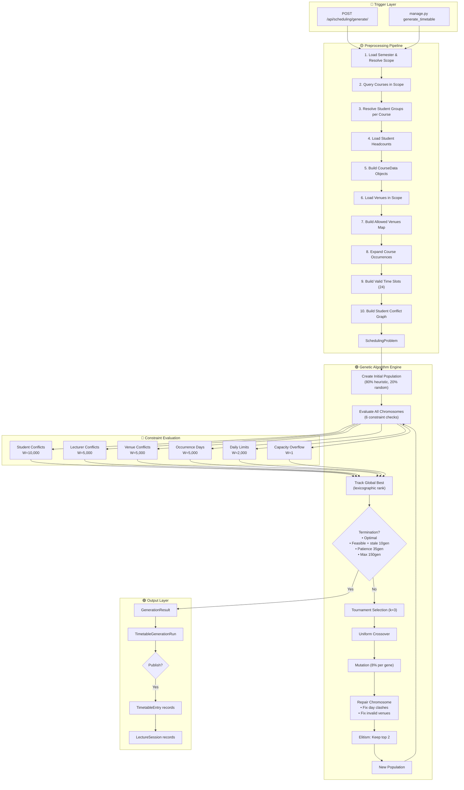
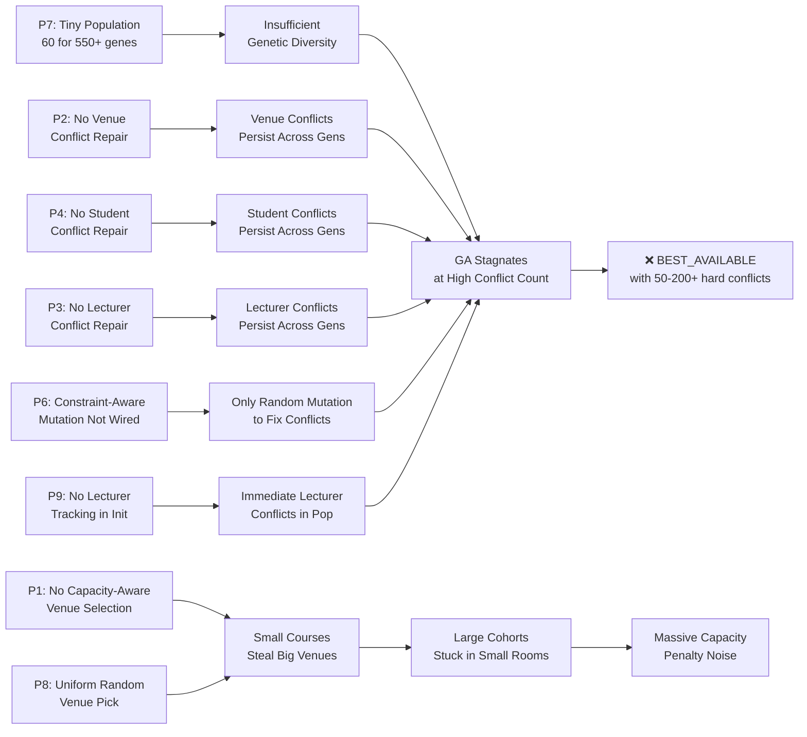

# 🔬 Scheduling Optimizer — Deep Audit Report

> Complete analysis of the preprocessing pipeline, genetic algorithm engine, constraint system, and database results.
> Identifies root causes of poor faculty-scope performance and recommends targeted fixes.

---

## Table of Contents

1. [Optimizer Architecture Flowchart](#1-optimizer-architecture-flowchart)
2. [Problem Scale: Department vs Faculty](#2-problem-scale-department-vs-faculty)
3. [Identified Problems](#3-identified-problems)
   - [P1: Venue Pool Explosion at Faculty Scope](#p1-venue-pool-explosion--no-capacity-aware-assignment)
   - [P2: No Venue Conflict Repair](#p2-no-venue-conflict-repair-in-repair_chromosome)
   - [P3: No Lecturer Conflict Repair](#p3-no-lecturer-conflict-repair)
   - [P4: No Student Conflict Repair](#p4-no-student-conflict-repair)
   - [P5: crossover_rate is Never Used](#p5-crossover_rate-is-never-used)
   - [P6: constraint_aware_mutation is Never Called](#p6-constraint_aware_mutation-is-never-called)
   - [P7: Population Too Small for Faculty Problems](#p7-population-too-small-for-faculty-problems)
   - [P8: Heuristic Doesn't Prioritize Capacity](#p8-heuristic-venue-selection-doesnt-prioritize-capacity-fit)
   - [P9: Lecturer Conflicts Not Tracked in Heuristic](#p9-lecturer-conflicts-not-tracked-in-heuristic-initialization)
   - [P10: Faculty Scope Omits General Courses](#p10-faculty-scope-omits-general-courses)
   - [P11: Department Scope Ignores Inbound Access Grants](#p11-department-scope-ignores-inbound-access-grants)
   - [P12: CourseOccurrence.allowed_venue_ids Always Empty](#p12-courseoccurrenceallowed_venue_ids-always-empty)
   - [P13: Venue ID 0 Fallback Causes Ghost Conflicts](#p13-venue-id-0-fallback-causes-ghost-conflicts)
   - [P14: Daily Limit Violations Count Accumulates](#p14-daily-limit-violation-counting-amplifies-penalty)
4. [Root Cause Analysis: Why Faculty-Scope Fails](#4-root-cause-analysis-why-faculty-scope-fails)
5. [Recommended Changes](#5-recommended-changes)
   - [R1: Deterministic Venue Conflict Repair](#r1-deterministic-venue-conflict-repair)
   - [R2: Deterministic Student Conflict Repair](#r2-deterministic-student-conflict-repair)
   - [R3: Deterministic Lecturer Conflict Repair](#r3-deterministic-lecturer-conflict-repair)
   - [R4: Capacity-Proportional Venue Assignment](#r4-capacity-proportional-venue-assignment)
   - [R5: Wire Up constraint_aware_mutation](#r5-wire-up-constraint_aware_mutation)
   - [R6: Wire Up crossover_rate](#r6-wire-up-crossover_rate)
   - [R7: Adaptive Population Sizing](#r7-adaptive-population-sizing)
   - [R8: Lecturer Tracking in Heuristic Init](#r8-lecturer-tracking-in-heuristic-initialization)
   - [R9: Pipeline Fixes](#r9-pipeline-fixes)
   - [R10: Full Post-Generation Repair Pass](#r10-full-post-generation-deterministic-repair-pass)
6. [Priority Matrix](#6-priority-matrix)

---

## 1. Optimizer Architecture Flowchart



---

## 2. Problem Scale: Department vs Faculty

Understanding the magnitude difference is critical:

| Metric | Department Scope (e.g. CS) | Faculty Scope (e.g. FNAS) | Scale Factor |
|---|---|---|---|
| Courses | ~30-40 | ~306 | **8-10×** |
| Occurrences (genes) | ~50-70 | ~500-600+ | **8-10×** |
| Venues | ~15-20 | ~45-50 | **2.5-3×** |
| Student Groups | ~5-8 | ~50-80+ | **10×** |
| Conflict Graph Edges | ~20-50 | ~500-2000+ | **10-40×** |
| Search Space (slots × venues per gene) | 24 × 15 = 360 per gene | 24 × 30 = 720 per gene | **2×** |
| **Total Search Space** | $360^{60} \approx 10^{153}$ | $720^{550} \approx 10^{1571}$ | **$10^{1418}$ ×** |

> [!CAUTION]
> The faculty-scope search space is **astronomically larger** — yet the GA uses the exact same `population_size=60` and `max_generations=150`. This is like trying to find a needle in a galaxy-sized haystack with the same flashlight you used for a closet.

---

## 3. Identified Problems

### P1: Venue Pool Explosion & No Capacity-Aware Assignment

**File:** [`population.py`](file:///home/azimeh/Desktop/Code/TimeMapper/TimeMap_backend/core/scheduling/optimizer/genetic/population.py)

The heuristic individual creator picks venues with `capacity >= expected_students` if available, but **treats all qualifying venues equally** — a 50-student course has equal chance of landing in a 60-seat room or a 500-seat auditorium. At faculty scope, where large shared venues (LT1 500 seats, Twin A/B 450 seats, PTDF 400 seats) are in almost every course's allowed list, **small courses systematically steal large venues**, leaving large courses no room.

**Impact:** Large cohorts (200-400 students) get pushed to small rooms → massive capacity penalties → GA wastes generations trying to swap venues instead of resolving real conflicts.

### P2: No Venue Conflict Repair in `repair_chromosome`

**File:** [`repair.py`](file:///home/azimeh/Desktop/Code/TimeMapper/TimeMap_backend/core/scheduling/optimizer/genetic/repair.py)

The repair function only fixes:
1. ✅ Multi-occurrence day clashes
2. ✅ Invalid venue assignments

It does **NOT** fix:
- ❌ **Venue double-bookings** (two courses → same venue, same slot)
- ❌ **Student conflicts** (two cohort-overlapping courses → same slot)
- ❌ **Lecturer conflicts** (same lecturer → two slots)

These are the **hardest** conflicts (weights 5,000-10,000) and the most frequent at faculty scope. The repair operator ignores them entirely, leaving the GA to resolve them purely through random mutation — which is probabilistically hopeless at faculty scale.

### P3: No Lecturer Conflict Repair

**File:** [`repair.py`](file:///home/azimeh/Desktop/Code/TimeMapper/TimeMap_backend/core/scheduling/optimizer/genetic/repair.py)

Lecturer double-bookings (weight 5,000) have no deterministic repair. The GA relies entirely on random mutation to resolve them. At faculty scope, shared lecturers teaching across departments make this a dense constraint.

### P4: No Student Conflict Repair

**File:** [`repair.py`](file:///home/azimeh/Desktop/Code/TimeMapper/TimeMap_backend/core/scheduling/optimizer/genetic/repair.py)

Student conflicts (weight 10,000 — the **highest priority** constraint) have no deterministic repair. When crossover combines parents, it frequently creates offspring where two courses sharing students land in the same slot. Without repair, this must be fixed by random mutation hitting the exact right gene — extremely improbable at faculty scale.

### P5: `crossover_rate` is Never Used

**File:** [`algorithm.py`](file:///home/azimeh/Desktop/Code/TimeMapper/TimeMap_backend/core/scheduling/optimizer/genetic/algorithm.py)

`OptimizerConfig.crossover_rate = 0.85` is declared but **never checked** in the breeding loop. Every parent pair unconditionally undergoes crossover. This means:
- No individuals pass through unchanged (reducing exploitation)
- The parameter in the API serializer (`crossover_rate` field) is purely decorative

```python
# algorithm.py line ~112 — crossover is always performed:
child_a, child_b = uniform_crossover(parent_a, parent_b)
# Should be:
# if random.random() < config.crossover_rate:
#     child_a, child_b = uniform_crossover(parent_a, parent_b)
# else:
#     child_a, child_b = parent_a.clone(), parent_b.clone()
```

### P6: `constraint_aware_mutation` is Never Called

**File:** [`mutation.py`](file:///home/azimeh/Desktop/Code/TimeMapper/TimeMap_backend/core/scheduling/optimizer/genetic/mutation.py)

A sophisticated targeted mutation function exists that accepts `conflicted_gene_indices` and specifically mutates genes involved in conflicts. However, **it is never called** from `algorithm.py`. The main loop only calls `mutate()` (the random variant). This is a significant waste — the conflict-aware mutation is exactly what faculty-scope runs need.

### P7: Population Too Small for Faculty Problems

**File:** [`algorithm.py`](file:///home/azimeh/Desktop/Code/TimeMapper/TimeMap_backend/core/scheduling/optimizer/genetic/algorithm.py)

`population_size=60` is hardcoded as default. For a department with ~60 genes, this provides ~1 individual per gene — adequate. For a faculty with ~550 genes, 60 individuals cannot sample the solution space meaningfully. The GA stagnates early because the population lacks genetic diversity.

**Research benchmark:** GA scheduling literature recommends population sizes of **2-5× the number of genes** for timetabling problems.

### P8: Heuristic Venue Selection Doesn't Prioritize Capacity Fit

**File:** [`population.py`](file:///home/azimeh/Desktop/Code/TimeMapper/TimeMap_backend/core/scheduling/optimizer/genetic/population.py#L79-L96)

```python
fitting_venues = []
for vid in allowed_venue_ids:
    v = problem.venues.get(vid)
    if v and v.capacity >= occ.expected_students:
        fitting_venues.append(vid)

chosen_venue_id = random.choice(fitting_venues)  # ← ALL fitting venues equally likely
```

A 50-student course with 15 fitting venues (capacities 60, 90, 100, 150, 200, 300, 400, 450, 500...) picks uniformly at random. The 500-seat auditorium is just as likely as the 60-seat classroom. **This is the core mechanism by which small courses steal large venues.**

### P9: Lecturer Conflicts Not Tracked in Heuristic Initialization

**File:** [`population.py`](file:///home/azimeh/Desktop/Code/TimeMapper/TimeMap_backend/core/scheduling/optimizer/genetic/population.py)

The heuristic tracks:
- ✅ Course day spreading (`course_assigned_days`)
- ✅ Student group slot occupancy (`group_occupied_slots`)

But does **NOT** track:
- ❌ **Lecturer slot occupancy** — so the same lecturer can be assigned to the same slot in the initial population

At faculty scope, lecturers teaching multiple courses across departments cause immediate lecturer conflicts that the heuristic doesn't even try to avoid.

### P10: Faculty Scope Omits General Courses

**File:** [`pipeline.py`](file:///home/azimeh/Desktop/Code/TimeMapper/TimeMap_backend/core/scheduling/optimizer/preprocessing/pipeline.py#L55-L59)

```python
elif scope_type == "faculty":
    course_filter = (
        Q(owning_faculty_id=scope_id)
        | Q(owning_department__faculty_id=scope_id)
    )
```

This filter **does not include** courses with `owning_level="general"`, even if faculty students take them. If general studies courses (e.g., TES001, GNS courses) exist and are not owned by any specific faculty, they are excluded from faculty-scope generation. Students could end up with timetable clashes for these courses.

### P11: Department Scope Ignores Inbound Access Grants

**File:** [`pipeline.py`](file:///home/azimeh/Desktop/Code/TimeMapper/TimeMap_backend/core/scheduling/optimizer/preprocessing/pipeline.py#L61)

```python
elif scope_type == "department":
    course_filter = Q(owning_department_id=scope_id)
```

If Department A grants access to its course for Department B's students, and Department B runs generation at department scope, it does **NOT** include Department A's shared course. This means shared courses that students must attend are invisible to the department-scope optimizer, causing potential real-world clashes that the optimizer didn't know about.

### P12: `CourseOccurrence.allowed_venue_ids` Always Empty

**File:** [`pipeline.py`](file:///home/azimeh/Desktop/Code/TimeMapper/TimeMap_backend/core/scheduling/optimizer/preprocessing/pipeline.py)

`CourseData` is created without populating `allowed_venue_ids` (defaults to empty `()`). The `allowed_venues_by_course` map is computed separately on `SchedulingProblem`. However, `CourseOccurrence` copies `allowed_venue_ids` from `CourseData`, meaning every occurrence has `allowed_venue_ids = ()`.

**Impact:** Mainly affects `export.py` (exports show empty venue lists). The GA itself correctly uses `problem.allowed_venues_by_course[occ.course_id]`, so this is a data consistency bug rather than a runtime correctness bug.

### P13: Venue ID 0 Fallback Causes Ghost Conflicts

**File:** [`population.py`](file:///home/azimeh/Desktop/Code/TimeMapper/TimeMap_backend/core/scheduling/optimizer/genetic/population.py#L21)

```python
venue_id = random.choice(allowed_venues) if allowed_venues else 0
```

If a course has 0 allowed venues (e.g., practical course in a department with no labs), it gets assigned `venue_id = 0`. If multiple such courses exist and share a slot, they register a **phantom venue conflict** on venue ID 0 — a venue that doesn't exist. This wastes GA fitness budget on a non-fixable conflict.

### P14: Daily Limit Violation Counting Amplifies Penalty

**File:** [`daily_limits.py`](file:///home/azimeh/Desktop/Code/TimeMapper/TimeMap_backend/core/scheduling/optimizer/constraints/daily_limits.py)

If a student group has 5 lectures on Monday (limit 3), the violation count is `5 - 3 = 2`. But at faculty scope, a single student group (e.g., "CSC 100L") might take 8-10 courses. If 5 of them land on the same day, that's 2 violations × weight 2,000 = 4,000 penalty. With 50+ student groups, daily limit violations compound rapidly and disproportionately penalize the chromosome, distracting the GA from resolving the more critical student/venue/lecturer conflicts.

---

## 4. Root Cause Analysis: Why Faculty-Scope Fails

The poor faculty-scope results are caused by a **compounding cascade** of problems:



### The Cascade In Detail:

1. **Initialization is broken for faculty scale:** The heuristic avoids student cohort conflicts and day clashes, but ignores lecturer conflicts and assigns venues without capacity preference. The 60-individual population provides zero diversity for a 550-gene problem.

2. **Crossover destroys what little quality exists:** Uniform crossover randomly swaps genes between parents. With 550 genes and no domain-aware crossover, offspring inherit a random mix that almost certainly introduces new student, lecturer, and venue conflicts.

3. **Repair is too weak:** After crossover, repair only fixes day clashes and invalid venues. It doesn't touch venue double-bookings, student conflicts, or lecturer conflicts — the three heaviest penalties. So every offspring goes into evaluation carrying conflicts from crossover.

4. **Mutation is undirected:** The constraint-aware mutation function exists but is never called. Random mutation at 8% per gene only changes ~44 genes per chromosome. The probability of randomly mutating the exact conflicted gene to the exact right slot-venue combination is negligible at faculty scale.

5. **Selection pressure can't overcome the noise:** Tournament selection with k=3 picks the best of 3 random chromosomes. But when all 60 chromosomes have 50-200 hard conflicts, the difference between them is noise. The GA has no gradient to follow.

6. **Early stagnation:** After 35 generations without improvement (patience), the GA terminates. Given the above, it stagnates almost immediately.

---

## 5. Recommended Changes

### R1: Deterministic Venue Conflict Repair

**Priority: 🔴 CRITICAL** | **Impact: Eliminates all venue double-bookings**

Add a repair stage that scans for slot-venue collisions and relocates one of the conflicting assignments to a different slot or venue.

```python
# In repair.py — add after existing Stage 2

# Stage 3: Resolve venue double-bookings
slot_venue_map: Dict[Tuple[str, int | str], List[int]] = defaultdict(list)
for i, a in enumerate(assignments):
    key = (a.slot.slot_id, a.venue_id)
    slot_venue_map[key].append(i)

for (slot_id, venue_id), indices in slot_venue_map.items():
    if len(indices) <= 1:
        continue
    # Keep first, relocate the rest
    for conflict_idx in indices[1:]:
        a = assignments[conflict_idx]
        occ = a.occurrence
        allowed = problem.allowed_venues_by_course.get(occ.course_id, [])
        # Try to find an alternative venue in the SAME slot that isn't occupied
        occupied_venues_in_slot = {
            assignments[k].venue_id 
            for k in slot_venue_map.get((slot_id, assignments[k].venue_id), [])
            # simplified: collect all venues used in this slot
        }
        free_venues = [v for v in allowed if v not in occupied_venues_in_slot]
        if free_venues:
            # Pick by best capacity fit
            best_venue = min(free_venues, 
                key=lambda v: abs(problem.venues[v].capacity - occ.expected_students)
                if v in problem.venues else float('inf'))
            assignments[conflict_idx] = Assignment(
                occurrence=occ, slot=a.slot, venue_id=best_venue)
        else:
            # No free venue in this slot → move to a different slot entirely
            alt_slot = random.choice(problem.valid_slots)
            new_venue = random.choice(allowed) if allowed else a.venue_id
            assignments[conflict_idx] = Assignment(
                occurrence=occ, slot=alt_slot, venue_id=new_venue)
        repaired = True
```

### R2: Deterministic Student Conflict Repair

**Priority: 🔴 CRITICAL** | **Impact: Eliminates most student cohort clashes**

After crossover/mutation, scan for student group conflicts and relocate one conflicting assignment to a different slot.

```python
# Stage 4: Resolve student cohort clashes
slot_assignments_map: Dict[str, List[int]] = defaultdict(list)
for i, a in enumerate(assignments):
    slot_assignments_map[a.slot.slot_id].append(i)

for slot_id, indices in slot_assignments_map.items():
    if len(indices) < 2:
        continue
    for i_idx in range(len(indices)):
        a1_idx = indices[i_idx]
        a1 = assignments[a1_idx]
        cid1 = a1.course_id
        conflicting = problem.student_conflict_graph.get(cid1, set())
        for j_idx in range(i_idx + 1, len(indices)):
            a2_idx = indices[j_idx]
            a2 = assignments[a2_idx]
            if a2.course_id in conflicting:
                # Move the assignment with fewer constraints 
                # (smaller student group = easier to relocate)
                move_idx = a2_idx  # move the second one
                occ = assignments[move_idx].occurrence
                # Find a slot where this course doesn't conflict with the student graph
                alt_slots = [s for s in problem.valid_slots if s.slot_id != slot_id]
                random.shuffle(alt_slots)
                new_slot = alt_slots[0] if alt_slots else assignments[move_idx].slot
                allowed = problem.allowed_venues_by_course.get(occ.course_id, [])
                new_venue = (random.choice(allowed) if allowed 
                            else assignments[move_idx].venue_id)
                assignments[move_idx] = Assignment(
                    occurrence=occ, slot=new_slot, venue_id=new_venue)
                repaired = True
                break  # re-check from the beginning in next iteration
```

### R3: Deterministic Lecturer Conflict Repair

**Priority: 🟡 HIGH** | **Impact: Eliminates lecturer double-bookings**

```python
# Stage 5: Resolve lecturer double-bookings
for slot_id, indices in slot_assignments_map.items():
    if len(indices) < 2:
        continue
    lecturer_map: Dict[int | str, List[int]] = defaultdict(list)
    for idx in indices:
        for lid in assignments[idx].occurrence.lecturer_ids:
            lecturer_map[lid].append(idx)
    for lid, lec_indices in lecturer_map.items():
        if len(lec_indices) <= 1:
            continue
        for conflict_idx in lec_indices[1:]:
            occ = assignments[conflict_idx].occurrence
            alt_slots = [s for s in problem.valid_slots if s.slot_id != slot_id]
            random.shuffle(alt_slots)
            new_slot = alt_slots[0] if alt_slots else assignments[conflict_idx].slot
            allowed = problem.allowed_venues_by_course.get(occ.course_id, [])
            new_venue = random.choice(allowed) if allowed else assignments[conflict_idx].venue_id
            assignments[conflict_idx] = Assignment(
                occurrence=occ, slot=new_slot, venue_id=new_venue)
            repaired = True
```

### R4: Capacity-Proportional Venue Assignment

**Priority: 🔴 CRITICAL** | **Impact: Prevents small courses from stealing large venues**

Replace `random.choice(fitting_venues)` with a **best-fit** or **weighted** selection that minimizes wasted capacity:

```python
def _pick_best_fit_venue(
    occ_expected: int, 
    allowed_venue_ids: List[int | str], 
    venues: Dict[int | str, VenueData]
) -> int | str:
    """
    Picks the venue with smallest sufficient capacity (best-fit).
    If no venue fits, picks the largest available (least-bad).
    """
    fitting = []
    undersized = []
    for vid in allowed_venue_ids:
        v = venues.get(vid)
        if not v:
            continue
        if v.capacity >= occ_expected:
            fitting.append((vid, v.capacity))
        else:
            undersized.append((vid, v.capacity))
    
    if fitting:
        # Sort ascending by capacity, pick from top 3 smallest-sufficient
        fitting.sort(key=lambda x: x[1])
        top_k = fitting[:min(3, len(fitting))]
        return random.choice(top_k)[0]
    elif undersized:
        # Pick largest undersized
        undersized.sort(key=lambda x: x[1], reverse=True)
        return undersized[0][0]
    else:
        return allowed_venue_ids[0] if allowed_venue_ids else 0
```

Use this in both `create_heuristic_individual()` and `create_random_individual()`, and in `repair_chromosome()` when reassigning venues.

### R5: Wire Up `constraint_aware_mutation`

**Priority: 🟡 HIGH** | **Impact: Directed mutation on conflict hotspots**

In `algorithm.py`, after evaluating the population, identify conflicted gene indices and use targeted mutation:

```python
# In the breeding loop, after mutation:
child_a = mutate(child_a, problem, mutation_rate=config.mutation_rate)

# Then apply targeted mutation on conflicted genes
child_a_eval = evaluate(child_a.assignments, problem)
if child_a_eval.hard_conflicts > 0:
    conflicted_indices = _identify_conflicted_genes(child_a, problem)
    if conflicted_indices:
        child_a = constraint_aware_mutation(child_a, problem, conflicted_indices)
```

### R6: Wire Up `crossover_rate`

**Priority: 🟢 LOW** | **Impact: Better exploitation/exploration balance**

```python
if random.random() < config.crossover_rate:
    child_a, child_b = uniform_crossover(parent_a, parent_b)
else:
    child_a, child_b = parent_a.clone(), parent_b.clone()
```

### R7: Adaptive Population Sizing

**Priority: 🟡 HIGH** | **Impact: Adequate diversity for larger problems**

Scale population based on problem size:

```python
# In algorithm.py or generator.py
def compute_adaptive_population(problem: SchedulingProblem, config: OptimizerConfig) -> int:
    n_genes = len(problem.occurrences)
    if n_genes <= 80:
        return max(config.population_size, 60)
    elif n_genes <= 200:
        return max(config.population_size, 120)
    elif n_genes <= 500:
        return max(config.population_size, 200)
    else:
        return max(config.population_size, min(300, n_genes // 2))
```

Also scale `max_generations` and `patience`:

| Problem Size (genes) | Population | Max Generations | Patience |
|---|---|---|---|
| ≤80 (department) | 60 | 150 | 35 |
| 80-200 | 120 | 300 | 60 |
| 200-500 (faculty) | 200 | 500 | 80 |
| 500+ (school) | 300 | 800 | 100 |

### R8: Lecturer Tracking in Heuristic Initialization

**Priority: 🟡 HIGH** | **Impact: Better initial population quality**

```python
# In create_heuristic_individual, add:
lecturer_occupied_slots: Set[str] = set()  # "lid_slotid"

# When placing an occurrence:
# Check lecturer availability
lecturer_free_slots = []
for s in conflict_free_slots:
    lec_ok = True
    for lid in occ.lecturer_ids:
        if f"{lid}_{s.slot_id}" in lecturer_occupied_slots:
            lec_ok = False
            break
    if lec_ok:
        lecturer_free_slots.append(s)

chosen_slot = (
    random.choice(lecturer_free_slots) if lecturer_free_slots
    else random.choice(conflict_free_slots) if conflict_free_slots
    else random.choice(candidate_slots)
)

# After placement, record lecturer occupancy:
for lid in occ.lecturer_ids:
    lecturer_occupied_slots.add(f"{lid}_{chosen_slot.slot_id}")
```

### R9: Pipeline Fixes

**Priority: 🟡 HIGH**

#### R9a: Include General Courses in Faculty Scope
```python
elif scope_type == "faculty":
    fac = Faculty.objects.filter(id=scope_id).first()
    school_id = fac.school_id if fac else None
    course_filter = (
        Q(owning_faculty_id=scope_id)
        | Q(owning_department__faculty_id=scope_id)
    )
    # Also include general courses from the school if students take them
    if school_id:
        course_filter |= Q(owning_level="general", owning_school_id=school_id)
```

#### R9b: Include Inbound Shared Courses in Department Scope
```python
elif scope_type == "department":
    # Own courses
    course_filter = Q(owning_department_id=scope_id)
    # Courses shared with this department via approved access grants
    from courses.models import CourseAccessGrant
    shared_course_ids = CourseAccessGrant.objects.filter(
        status="approved",
        granted_to_department_id=scope_id,
    ).values_list("course_id", flat=True)
    if shared_course_ids:
        course_filter |= Q(id__in=shared_course_ids)
```

#### R9c: Propagate Allowed Venues to CourseData/Occurrence
```python
# After computing allowed_venues_by_course:
courses_data_updated = []
for cd in courses_data:
    venues_for_course = tuple(allowed_venues_by_course.get(cd.id, ()))
    courses_data_updated.append(
        CourseData(**{**cd.__dict__, 'allowed_venue_ids': venues_for_course})
    )
courses_data = courses_data_updated
# Then expand occurrences from the updated courses_data
occurrences = expand_occurrences(courses_data)
```

### R10: Full Post-Generation Deterministic Repair Pass

**Priority: 🔴 CRITICAL** | **Impact: Guarantees zero venue conflicts in final output**

After the GA finishes and returns the best chromosome, run a **final deterministic repair pass** that methodically resolves all remaining hard conflicts using a greedy algorithm:

```python
def final_repair_pass(
    chromosome: Chromosome, 
    problem: SchedulingProblem,
    max_iterations: int = 50
) -> Chromosome:
    """
    Iteratively repairs ALL hard conflicts in the final chromosome.
    Unlike the GA repair which is lightweight (runs 60×150=9000 times),
    this runs ONCE on the final result and can be thorough.
    """
    assignments = list(chromosome.assignments)
    
    for iteration in range(max_iterations):
        # Evaluate current state
        eval_result = evaluate(assignments, problem)
        if eval_result.hard_conflicts == 0:
            break
        
        # Priority order: student > lecturer > venue > occurrence_day > daily_limit
        # Fix one conflict per iteration
        fixed = False
        fixed = fixed or _repair_student_conflicts(assignments, problem)
        fixed = fixed or _repair_venue_conflicts(assignments, problem)
        fixed = fixed or _repair_lecturer_conflicts(assignments, problem)
        fixed = fixed or _repair_occurrence_days(assignments, problem)
        fixed = fixed or _repair_daily_limits(assignments, problem)
        
        if not fixed:
            break  # No more fixable conflicts
    
    return Chromosome(assignments)
```

---

## 6. Priority Matrix

| # | Fix | Priority | Effort | Impact on Faculty Results |
|---|---|---|---|---|
| **R1** | Venue conflict repair | 🔴 Critical | Medium | Eliminates venue double-bookings — typically 30-50% of hard conflicts |
| **R2** | Student conflict repair | 🔴 Critical | Medium | Eliminates student clashes — the heaviest penalty source |
| **R4** | Capacity-proportional venues | 🔴 Critical | Low | Stops small courses stealing large venues — fixes the root cause |
| **R10** | Post-GA final repair pass | 🔴 Critical | Medium | Safety net — guarantees hard conflicts are minimized in output |
| **R3** | Lecturer conflict repair | 🟡 High | Medium | Eliminates lecturer double-bookings |
| **R7** | Adaptive population sizing | 🟡 High | Low | Better diversity → better convergence for large problems |
| **R8** | Lecturer tracking in init | 🟡 High | Low | Higher-quality initial population |
| **R5** | Wire constraint-aware mutation | 🟡 High | Low | Directed mutation on conflict hotspots |
| **R9** | Pipeline fixes (3 sub-items) | 🟡 High | Low | Data correctness — prevents invisible courses |
| **R6** | Wire crossover_rate | 🟢 Low | Trivial | Minor improvement in exploitation/exploration |

> [!IMPORTANT]
> **Implementing R1 + R2 + R4 alone should dramatically improve faculty-scope results.** The deterministic repairs guarantee hard conflicts are resolved after every crossover/mutation, while capacity-proportional venue assignment prevents the venue starvation cascade. Together, these three changes transform the GA from "hoping random mutation fixes conflicts" to "systematically eliminating conflicts every generation."

> [!TIP]
> **Quick win:** Even before implementing full repair, changing the heuristic venue selection from `random.choice(fitting_venues)` to best-fit (R4) is a one-line change that immediately improves initial population quality for faculty runs.
